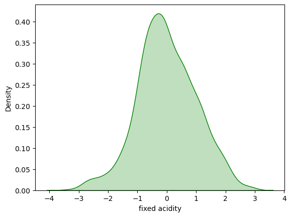
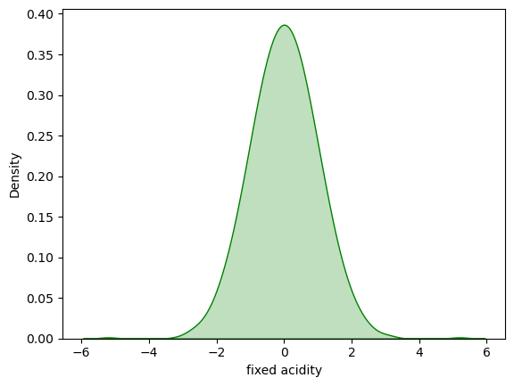
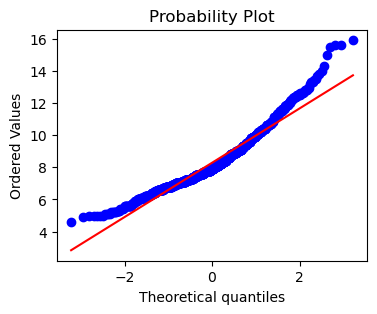
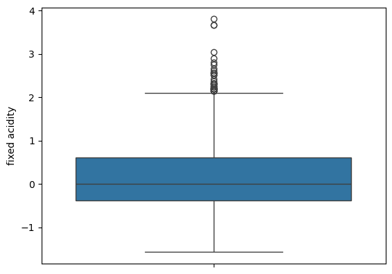

# Wine Quality Prediction

## Project Overview

This project focuses on analyzing and preprocessing the Wine Quality dataset using Exploratory Data Analysis (EDA), outlier detection, and data transformation techniques.

## Objectives

- Understand data distribution
- Detect and analyze outliers
- Check normality using Q-Q plots
- Apply transformation techniques
- Prepare data for Machine Learning models

## Technologies Used

- Python
- Pandas
- NumPy
- Matplotlib
- Seaborn
- Scikit-learn

## Visualizations

### Before Transformation

The Fixed Acidity feature showed a skewed distribution and was not perfectly normal.

### After Transformation

After applying transformation techniques, the distribution became more symmetric and closer to normal.

### Q-Q Plot

The Q-Q plot was used to evaluate normality. Deviations from the reference line indicate the presence of outliers.

### Outlier Detection

The box plot identified several outliers in the Fixed Acidity feature.

## Conclusion

Data preprocessing and transformation improved the quality of the dataset and made it more suitable for Machine Learning algorithms.

## Author

Pooja Kalloli

Final Year CSE Student | Data Science & Generative AI
